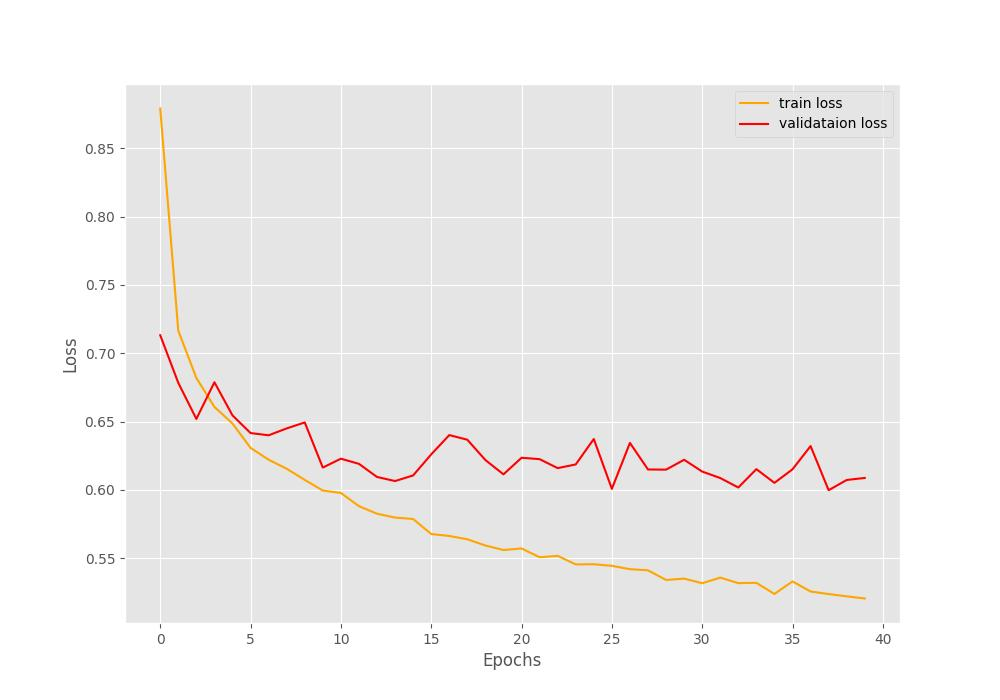

# Multi-Label Fashion Product

## **프로젝트 개요**
- 상품 이미지를 활용하여 상품의 네 가지 속성 (gender, articleType, season, usage) 을 추출하는 모델 생성
- 다음 kaggle 데이터를 이용하여, 이미지와 상품 메타 정보를 이용하여 위 네 가지 속성을 추론하는 모델 학습 및 추론 성능 측정

### 활용 데이터
- 메타 데이터 : https://www.kaggle.com/datasets/paramaggarwal/fashion-product-images-small?select=styles.csv
- 이미지 데이터 : https://www.kaggle.com/datasets/paramaggarwal/fashion-product-images-small?select=images

### Reference code
- https://www.kaggle.com/code/sovitrath/multi-label-fashion-classification

---
## **How to use**
1. 데이터 다운로드
- Kaggle 데이터 다운로드 후, data/ 폴더 하위에 위치 (images, styles.csv)
    - 메타 데이터 : https://www.kaggle.com/datasets/paramaggarwal/fashion-product-images-small?select=styles.csv
    - 이미지 데이터 : https://www.kaggle.com/datasets/paramaggarwal/fashion-product-images-small?select=images

2. 환경 내 requirements 패키지 설치
```
pip install -r requirements.txt
```
3. label dictionary 생성
```
python label_dicts.py
```
4. 학습 및 추론
```
python run.py
```
---
## **사용 모델 및 하이퍼 파라미터**
- Model
    - Pretrained ResNet50 (MultiHead)
- Loss
    - Cross Entropy Loss
- Hyper Parameter
    - Learning rate : 0.001
    - Optimizer : Adam
    - Batch size : 32
    - Epoch : 40


---
## **모델 성능**
- Train/Valid loss


- Inference 성능
    |Columns|Accuracy|
    |------|---|
    |gender|84.7%|
    |articleType|78.6%|
    |season|67.5%|
    |usage|87.0%|
    |**Average**|**79.45%**|
